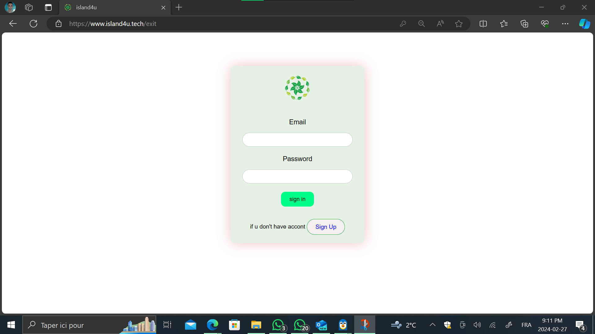

# PROJECT IMOBILIER

# login   👨🏼‍💻


# landing_page  👋🏻


# dashboard  🏡


# user_profile   👨🏼‍💼


# add_prduct


# product_detail


### `app.py` (Flask Application) 🐍

1. **Shebang Line:**
   ```python
   #!/usr/bin/python3
   ```
   This line specifies the interpreter that should be used to execute the script.

2. **Module Docstring:**
   ```python
   """starting flask"""
   ```
   This docstring provides a brief description of the script's purpose.

3. **Import Statements:**
   - The script imports necessary modules and packages, including Flask, Flask extensions (`Flask-Login` for user authentication and `Flask-Migrate` for database migrations), `sqlalchemy` for database operations, and others.

4. **App Configuration:**
   - The `create_app` function sets up the Flask application and configures various settings, such as the database URI, track modifications, secret key, and upload folder.

5. **Database Initialization:**
   - The script initializes the Flask application, database (`db`), migration (`migrate`), and login manager (`login_manager`).

6. **User Loader Function:**
   - The user loader function (`load_user`) is used by Flask-Login to load a user from the database based on the user ID.

7. **Routes:**
   - The script defines several routes (`/`, `/signup`, `/login`, `/dashboard`, `/user/<username>`, `/exit`, `/add_product`, `/delete_product/<string:product_id>`, `/product/<string:product_id>`, `/serve_image/<filename>`), each handling different functionalities like rendering templates, user registration, login, dashboard display, adding and deleting products, and serving images.

8. **Helper Functions:**
   - The script includes helper functions like `save_uploaded_image` and `get_product_details` to assist with image uploads and retrieving product details.

9. **Database Creation:**
   - The script creates all necessary database tables using `db.create_all()`.

10. **App Instance:**
    - Finally, the script returns the Flask application instance.

### `user.py` (SQLAlchemy Models)

1. **Module Docstring:**
   ```python
   """
   class user for stor data info and sqlalchemy
   """
   ```
   This docstring provides a brief description of the script's purpose.

2. **Import Statements:**
   - The script imports necessary modules, including SQLAlchemy for defining database models, `UserMixin` for Flask-Login compatibility, and others.

3. **Database Models:**
   - The script defines two models:
     - `User`: Represents user data with columns such as `id`, `username`, `city`, `email`, and `password_hash`. It includes methods for setting and checking passwords.
     - `Products`: Represents product data with columns such as `id`, `name`, `city`, `price`, `image_path`, `num_rooms`, `section`, `num_bain`, `window_per_house`, and `user_id`. It establishes a relationship with the `User` model.

4. **Relationships:**
   - The `User` model has a one-to-many relationship with the `Products` model, allowing users to have multiple associated products.

Is Python script is a Flask web application for managing real estate properties. Let's break down the code to understand its functionality:

1. **Shebang line:**
   ```python
   #!/usr/bin/python3
   ```
   This line specifies the Python interpreter to be used when executing the script.

2. **Docstring:**
   ```python
   """starting flask"""
   ```
   A docstring providing a brief description or comment. In this case, it indicates that the script is starting a Flask application.

3. **Import Statements:**
   ```python
   from flask_migrate import Migrate
   from sqlalchemy import asc
   import os
   from flask_login import LoginManager, UserMixin, login_user, login_required, logout_user, current_user
   from .user import User, Products, db
   from .db import get_user_data
   from flask import Flask, render_template, request, redirect, url_for, flash, send_from_directory
   import uuid
   ```
   These statements import necessary modules and classes for the Flask application, including Flask itself, SQLAlchemy for database operations, Flask-Login for user authentication, and others.

4. **Initialization of Flask Extensions:**
   ```python
   login_manager = LoginManager()
   migrate = Migrate()
   ```
   Instances of Flask extensions (`LoginManager` and `Migrate`) are created for handling user login and database migrations.

5. **`create_app` Function:**
   ```python
   def create_app():
   ```
   This function is defined to create the Flask application and configure its settings.

6. **Application Configuration:**
   ```python
   app.config['SQLALCHEMY_DATABASE_URI'] = 'sqlite:///imobilier.db'
   app.config['SQLALCHEMY_TRACK_MODIFICATIONS'] = False
   app.config['SECRET_KEY'] = 'HASSANBOUDRAA8@'
   app.config['UPLOAD_FOLDER'] = 'uploads'
   ```
   Configuration settings for the Flask application, such as database URI, secret key, and upload folder.

7. **Extension Initialization:**
   ```python
   db.init_app(app)
   migrate.init_app(app, db)
   login_manager.init_app(app)
   ```
   Initialization of Flask extensions with the created Flask app.

8. **User Loader Function:**
   ```python
   @login_manager.user_loader
   def load_user(user_id):
       return User.query.get(user_id)
   ```
   A user loader function for Flask-Login, used to retrieve a user from the database based on the user ID.

9. **Route Definitions:**
   The script defines several routes (`@app.route(...)`) for different pages, including the home page, signup, login, dashboard, user profile, adding and deleting products, and serving images.

10. **Helper Functions:**
    - `save_uploaded_image`: Saves an uploaded image to a specific folder and returns the file path.
    - `get_product_details`: Retrieves details of a product based on its ID from the database.
    
11. **Database Initialization:**
    ```python
    with app.app_context():
        db.create_all()
    ```
    This block initializes the database by creating all the defined models.

12. **Returning the App:**
    ```python
    return app
    ```
    Finally, the function returns the configured Flask app.

This script creates a Flask web application with user authentication, database operations, and various routes for managing real estate properties. It utilizes Flask extensions for added functionality and follows the MVC (Model-View-Controller) pattern, separating concerns for better maintainability.


